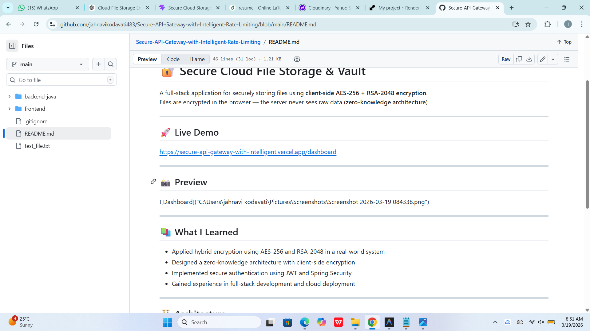

# 🔐 Secure Cloud File Storage & Vault

A full-stack application for securely storing files using **client-side AES-256 + RSA-2048 encryption**.  
Files are encrypted in the browser — the server never sees raw data (**zero-knowledge architecture**).

---

## 🚀 Live Demo  
https://secure-api-gateway-with-intelligent.vercel.app/login

---

## 📸 Preview  

---

## 📚 What I Learned  

- Applied hybrid encryption using AES-256 and RSA-2048 in a real-world system  
- Designed a zero-knowledge architecture with client-side encryption  
- Implemented secure authentication using JWT and Spring Security  
- Gained experience in full-stack development and cloud deployment  

---

## 🏗️ Architecture  

1. File encrypted using AES-256 (client-side)  
2. AES key encrypted using RSA public key  
3. Encrypted file → Cloudinary  
4. Metadata + encrypted key → MongoDB  
5. Decryption using user's private key  

---

## 🛠️ Tech Stack  

- Frontend: React (Vite)  
- Backend: Spring Boot, Java 17  
- Database: MongoDB Atlas  
- Storage: Cloudinary  
- Security: AES + RSA, JWT  
- Deployment: Vercel + Render  

---
